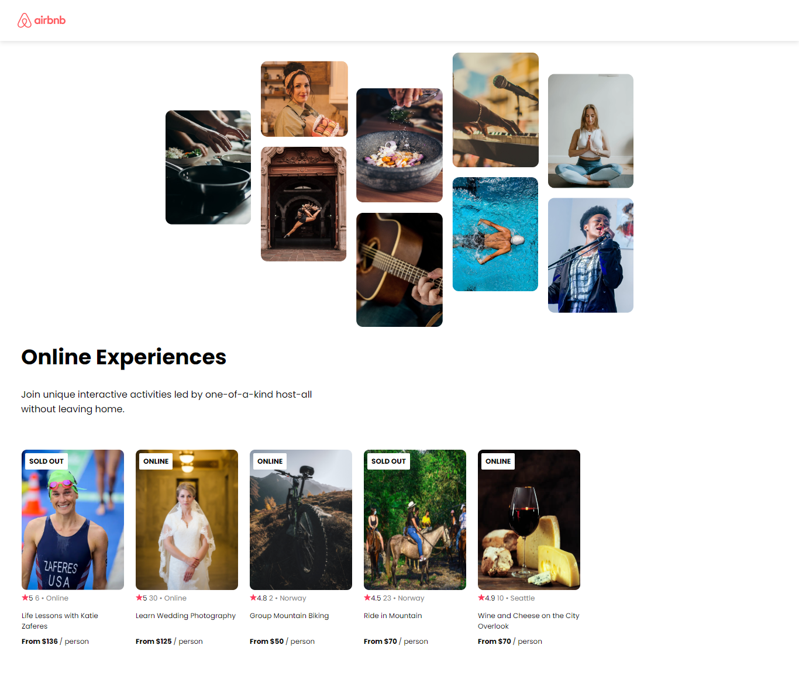

# Airbnb Experiences Clone

Este proyecto es un clon de la página de inicio de Airbnb Experiences. Utiliza React y Vite, y es una single page simple. Este proyecto es mi primer proyecto en React.

## Funcionalidades

Este clon de la página de inicio de Airbnb Experiences cuenta con las siguientes funcionalidades:

- Navegación: El proyecto incluye un componente de navegación que permite al usuario navegar por la página.
- Hero: La página incluye un componente Hero que muestra una imagen de fondo y un mensaje.
- Cards de Experiencias: En la página principal se muestran cards de experiencias. Las cards incluyen información como el título de la experiencia, la ubicación, el precio y una imagen.

## Tecnologías Utilizadas

- React
- Vite
- Javascript
- CSS